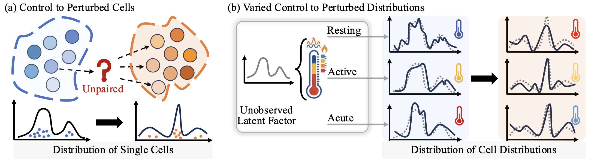
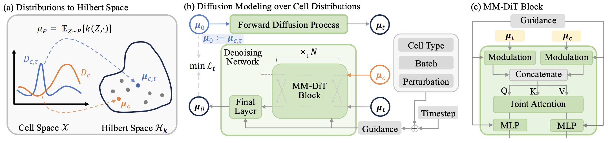

<div align="center">

# PerturbDiff: Functional Diffusion for Single-Cell Perturbation Modeling

[](https://pytorch.org/get-started/locally/)

[](https://arxiv.org/html/2602.19685v1)

</div>

PyTorch implementation of [PerturbDiff], a functional diffusion-based framework for single-cell perturbation modeling. Code authored by [Xinyu Yuan], [Xixian Liu], and [Yashi Zhang]; Code released by [Xinyu Yuan] and [Codex]; project supervised by [Jian Tang].

See our official [project page](https://katarinayuan.github.io/PerturbDiff-ProjectPage/) and our [interactive code guidance page](https://deepgraphlearning.github.io/PerturbDiff/).


[Xinyu Yuan]: https://github.com/KatarinaYuan
[Xixian Liu]: https://github.com/ZeroKnighting
[Yashi Zhang]: https://github.com/yashizhang
[Jian Tang]: https://jian-tang.com/
[Codex]: https://openai.com/zh-Hans-CN/index/introducing-codex/
[PerturbDiff]: https://arxiv.org/html/2602.19685v1

# Overview

Building **virtual cells** that can accurately simulate perturbation responses is a core challenge in systems biology. In single-cell sequencing, measurements are destructive, so the same cell cannot be observed both before and after perturbation. As a result, perturbation prediction must map between unpaired control and perturbed populations.

Most existing methods learn mappings between distributions but typically assume that, conditioned on observed context (for example cell type and perturbation), there is a single fixed target response distribution. In practice, **responses vary due to latent, unobserved factors** such as microenvironmental fluctuations and complex batch effects, creating **a manifold** of plausible response distributions **even under the same observed conditions**.



PerturbDiff addresses this by moving from cell-level generation to **distribution-level generation**. It represents populations in a Hilbert-space formulation and applies diffusion directly over probability distributions, enabling the model to capture population-level shifts induced by hidden factors rather than collapsing them into one average response.



On benchmark datasets, PerturbDiff is designed to improve both response prediction quality and robustness to unseen perturbations.

This repository contains the refactored runtime used for large-scale pretraining/finetuning/sampling:

- `src/`: functional code modules and executable entrypoints.
- `configs/`: Hydra configuration system for training and sampling.

# Table of Contents

- [Overview](#overview)
- [Feature](#feature)
- [Updates](#updates)
- [File Structure](#file-structure)
- [Installation](#installation)
  - [Option A: Conda/Mamba environment for `src` (recommended on cluster)](#option-a-condamamba-environment-for-src-recommended-on-cluster)
  - [Option B: venv](#option-b-venv)
- [General Configuration](#general-configuration)
- [Download](#download)
  - [Dataset](#dataset)
  - [Checkpoint](#checkpoint)
- [Setup](#setup)
  - [Quick Start](#quick-start)
  - [Entrypoints](#entrypoints)
  - [Shared CLI Blocks](#shared-cli-blocks)
  - [Scenario Index](#scenario-index)
    - [1.1) From Scratch on PBMC](#11-from-scratch-on-pbmc)
    - [1.2) From Scratch on Tahoe100M](#12-from-scratch-on-tahoe100m)
    - [1.3) From Scratch on Replogle](#13-from-scratch-on-replogle)
    - [2.1) Sampling on PBMC (from checkpoint; PBMC as an example)](#21-sampling-on-pbmc-from-checkpoint-pbmc-as-an-example)
    - [3) Pretraining](#3-pretraining)
    - [4.1) Finetuning on PBMC](#41-finetuning-on-pbmc)
    - [4.2) Finetuning on Tahoe100M](#42-finetuning-on-tahoe100m)
    - [4.3) Finetuning on Replogle](#43-finetuning-on-replogle)
  - [Notes](#notes)
- [Citation](#citation)

# Feature

- Functional refactor with clear module boundaries:
  - `src/apps`: run entrypoints for training/sampling
  - `src/models`: diffusion backbone/lightning logic
  - `src/data`: dataset/datamodule/sampling utilities
  - `src/common`: shared runtime utilities
- Hydra-based config composition under `configs/`.
- Unified pipeline for:
  - from scratch training (PBMC / Tahoe100M / Replogle)
  - pretraining (multi-source) and then finetuning (PBMC / Tahoe100M / Replogle)
  - conditional sampling from checkpoints

# Updates

- 2026-03-06: Release all codes.
- 2026-03-05: Release all data and ckpts on HuggingFace.
- 2026-02-23: Preprint released on Arxiv.

# File Structure

```text
src/
├── apps/
│   ├── run/                                  # Entry scripts
│   │   ├── rawdata_diffusion_training.py     # Main training entrypoint
│   │   └── rawdata_diffusion_sampling.py     # Main sampling entrypoint
│   ├── training/                             # Training workflow components
│   │   ├── training_pipeline.py              # Wrapper around trainer.fit()
│   │   ├── training_model_builder.py         # Model instantiation
│   │   ├── training_datamodule_builder.py    # DataModule construction
│   │   ├── training_runtime.py               # Trainer setup
│   │   ├── training_model_checkpoint.py      # Checkpoint loading and patching
│   │   └── training_model_compare.py         # Model comparison utilities
│   └── sampling/
│       ├── sampling_generation.py            # Main sampling loop
│       ├── sampling_generation_helpers.py    # Sampling helper functions
│       ├── sampling_setup.py                 # Sampling model loading
│       ├── sampling_io.py                    # Result persistence
│       └── sampling_utils.py                 # Device selection
├── models/
│   ├── cross_dit/                            # Core backbone network
│   │   ├── cross_dit_main.py                 # Cross_DiT main module
│   │   ├── cross_dit_blocks.py               # MM_DiTBlock / Cross_DiTBlock
│   │   ├── cross_dit_component.py            # Embedding layer components
│   │   └── cross_dit_init.py                 # Weight initialization
│   ├── diffusion/                            # Diffusion process
│   │   ├── diffusion_core.py                 # GaussianDiffusion assembly
│   │   ├── diffusion_schedules.py            # Beta schedules
│   │   ├── diffusion_sampling.py             # Sampling mixin
│   │   └── diffusion_training.py             # Training/loss mixin
│   ├── lightning/
│   │   ├── lightning_module.py               # PlModel (pl.LightningModule)
│   │   └── lightning_factories.py            # Factory functions (diffusion/optimizer/EMA)
│   ├── covariate_encoding.py                 # CovEncoder covariate encoder
│   ├── resampling.py                         # UniformSampler timestep sampler
│   └── weight_averaging_callback.py          # EMA weight averaging callback
├── data/
│   ├── dataset/
│   │   ├── dataset_core.py                   # H5adSentenceDataset
│   │   ├── dataset_grouping.py               # Grouped indexing / control split
│   │   └── dataset_io.py                     # H5 file reading
│   ├── data_module/
│   │   ├── data_module.py                    # DataModule class hierarchy
│   │   └── data_module_setup.py              # setup() workflow helpers
│   ├── metadata_cache.py                     # GlobalH5MetadataCache (singleton)
│   ├── file_handle.py                        # H5Store (file-handle management)
│   ├── sampler.py                            # CellSet batch samplers
│   └── split_strategy.py                     # Dataset split strategies
└── common/
    ├── utils.py                              # Utility function collection
    └── paths.py                              # Path management
```

# Installation

## Option A: Conda/Mamba environment for `src` (recommended on cluster)

```bash
# from login node
mamba create -n perturbdiff_newsrc python=3.9 -y
mamba activate perturbdiff_newsrc

# core DL + runtime
pip install --upgrade pip
pip install torch pytorch-lightning hydra-core omegaconf

# scientific + single-cell stack
pip install numpy pandas scipy scikit-learn matplotlib seaborn tqdm
pip install anndata scanpy h5py pyyaml typing_extensions

# model/runtime extras used by src
pip install transformers timm geomloss

# optional logging backend (only needed if you use WandbLogger)
pip install wandb
```

## Option B: venv

```bash
python -m venv .venv
source .venv/bin/activate
pip install --upgrade pip
pip install torch pytorch-lightning hydra-core omegaconf
pip install numpy pandas scipy scikit-learn matplotlib seaborn tqdm
pip install anndata scanpy h5py pyyaml typing_extensions
pip install transformers timm geomloss
pip install wandb
```

Sanity check:

```bash
python -c "import hydra,pytorch_lightning,torch,numpy,pandas,anndata,scanpy,h5py,yaml,sklearn,transformers,timm,geomloss; print('env ok')"
```

# General Configuration

Top-level Hydra configs:

- `configs/rawdata_diffusion_training.yaml`
- `configs/rawdata_diffusion_sampling.yaml`

Main config groups:

- `trainer/`: accelerator, devices, precision, steps, logging cadence
- `model/`: diffusion + backbone parameters
- `data/`: dataset assembly and split/filter behavior
- `path/`: dataset root, cache root, checkpoint/log root
- `lightning/`: callbacks + logger
- `optimization/`: optimizer/scheduler/seed/batch size
- `cov_encoding/`: perturb/celltype/batch encoding strategy

Example override:

```bash
python src/apps/run/rawdata_diffusion_training.py \
  run_name=debug \
  data=pbmc_finetune \
  trainer.accelerator=cpu \
  trainer.devices=1 \
  optimization.micro_batch_size=32
```

Training-time sampling validation is also available from the training entrypoint. This runs reverse diffusion from noise on a small validation subset during each validation event and logs `sampling_validation_r2_epoch` and `sampling_validation_mmd_epoch` without writing sample `.h5ad` files.

Example:

```bash
python src/apps/run/rawdata_diffusion_training.py \
  run_name=debug_sampling_eval \
  data=replogle_finetune \
  path=trixie_path \
  sampling_eval.enabled=true \
  sampling_eval.num_batches=1 \
  sampling_eval.use_ddim=true \
  sampling_eval.progress=false
```

Relevant options under `sampling_eval`:

- `enabled`: turn sampling-based validation on/off
- `split`: which validation split to sample on, default `validation`
- `num_batches`: how many validation batches to sample per validation event
- `use_ddim`, `start_time`, `eta`, `guidance_strength`, `nw`, `start_guide_steps`: reverse-diffusion controls reused from the standalone sampling path
- `seed`: RNG seed used for deterministic-enough sampling validation

# Flow / Rectified Flow

The repository now also includes a **separate rectified-flow pipeline** alongside the original diffusion pipeline.
The flow path does **not** reuse diffusion configs or diffusion entrypoints.

Flow entrypoints:

- `src/apps/run/rawdata_flow_training.py`
- `src/apps/run/rawdata_flow_sampling.py`

Flow config files:

- `configs/rawdata_flow_training.yaml`
- `configs/rawdata_flow_sampling.yaml`
- `configs/model/flow_base.yaml`
- `configs/lightning/flow_base.yaml`
- `configs/optimization/flow_base.yaml`

Flow Replogle helper scripts:

- `replogle_flow_from_scratch.sh`
- `replogle_flow_sampling.sh`

## Flow Behavior

Training uses rectified flow matching on paired control/perturbed cell sets:

- `x0`: control cells from `cont_emb`
- `x1`: perturbed cells from `pert_emb`
- pairing: controls are paired **within each cell set**, either by random permutation or Sinkhorn OT
- interpolation: `x_t = (1 - t) x0 + t x1`
- target velocity: `x1 - x0`
- terminal prediction: `x1_hat = x_t + (1 - t) v_t`

Loss:

- MSE term: flow-matching MSE between predicted velocity and `x1 - x0`
- MMD term: computed between `x1_hat` and `x1`
- weighted MMD: `alpha * t^gamma / (1 - t)`

Flow-specific knobs:

- `model.enable_self_condition`
  - `true`: the first layer sees concatenated `[x_t, x1_hat_prev]`
  - `false`: the first layer sees only `x_t`, so the input width stays at the base gene dimension
- `model.output_activation`
  - use `identity` for velocity prediction so negative values are allowed
- `model.pairing_strategy`
  - `within_set_random` keeps the old random pairing
  - `ot_sinkhorn` solves entropic OT inside each cell set and samples one control partner from each coupling row
- `model.ot_cost`
  - current flow OT implementation supports `l2_squared`
- `model.ot_reg`
  - entropy regularization strength for Sinkhorn OT
- `model.ot_num_iters`
  - maximum Sinkhorn iterations for OT pairing
- `model.ot_sampling`
  - current flow OT implementation supports `row_multinomial`
- `optimization.mmd_weight_alpha`
  - non-negative coefficient in the weighted MMD term
- `optimization.mmd_weight_gamma`
  - non-negative exponent in the weighted MMD term
- `sampling.flow_steps`
  - Euler integration steps used during inference
- `sampling.guidance_strength`
  - classifier-free guidance scale applied directly in velocity space

## Flow Training on Replogle

Primary script:

```bash
bash replogle_flow_from_scratch.sh
```

Useful smoke-test override:

```bash
bash replogle_flow_from_scratch.sh \
  trainer.max_steps=1 \
  trainer.limit_val_batches=1 \
  sampling_eval.num_batches=1 \
  data.num_workers=0 \
  data.prefetch_factor=null \
  optimization.micro_batch_size=64
```

Enable OT pairing on the same script by adding:

```bash
bash replogle_flow_from_scratch.sh model.pairing_strategy=ot_sinkhorn
```

This script keeps the same Replogle runtime assumptions as the diffusion helper:

- `data=replogle_finetune`
- fake-batch input file under `nadig_processed_data/replogle_fake_batch.h5ad`
- `data.use_cell_set=32`
- `cov_encoding.replogle_gene_encoding=genept`
- `cov_encoding.celltype_encoding=llm`
- `model.p_drop_control=0`

## Flow Sampling on Replogle

Set a full Lightning checkpoint and run:

```bash
CKPT_PATH=/abs/path/to/flow_checkpoint.ckpt bash replogle_flow_sampling.sh
```

Useful smoke-test override:

```bash
CKPT_PATH=/abs/path/to/flow_checkpoint.ckpt \
bash replogle_flow_sampling.sh \
  sampling.num_sampled_batches=1 \
  sampling.flow_steps=2 \
  data.num_workers=0 \
  data.prefetch_factor=null
```

Sampling starts from the control cells and integrates the learned velocity field from `t=0` to `t=1` with a fixed-step Euler solver.
Increasing `sampling.flow_steps` raises inference cost but usually gives a smoother approximation to the learned flow.

# Download

Use `huggingface_hub` CLI for both datasets and released checkpoints.

```bash
pip install -U "huggingface_hub[cli]"
```

## Dataset

Primary dataset source: [katarinayuan/PerturbDiff_data](https://huggingface.co/datasets/katarinayuan/PerturbDiff_data)

Download all dataset files:

```bash
hf download katarinayuan/PerturbDiff_data \
  --repo-type dataset \
  --local-dir ./data/PerturbDiff_data
```

> Note: The full dataset directory is large; you can choose to decompress selected files only. 
> finetune_data/tahoe100m_full_selected_processed_new contains almost 3T data after decompression.
> pbmc_new/Parse_10M_PBMC_cytokines_processed_Xselected.h5ad is around 750G after decompression.
> cellxgene_merged_zst/ contains around 1T data after decompression.

Expected data file structure:

```text
perturb_data/
├── finetune_data/
│   ├── pbmc_new/
│   │   └── Parse_10M_PBMC_cytokines_processed_Xselected.h5ad
│   ├── tahoe100m_full_selected_processed_new/
│   │   ├── plate1_filt_..._processed.h5ad
│   │   ├── plate2_filt_..._processed.h5ad
│   │   └── ...
│   └── nadig_processed_data/
│       └── replogle.h5ad
├── cellxgene_merged_zst/
│   ├── proc_cellxgene_combined_1.h5ad
│   ├── proc_cellxgene_combined_2.h5ad
│   └── ...
├── gene_names/
│   ├── pbmc_full_gene.pkl
│   ├── replogle_gene_emb_dict_perturbation_emb_dict.pkl
│   └── ...
├── indices_cache/
│   ├── grouped_pert_data_indices_*.pkl
│   ├── grouped_pert_num_cell_*.pkl
│   └── ...
├── selected_genes/
│   └── *.pkl
└── meta_data/
    └── *.pkl
```


## Checkpoint

Released checkpoints can be downloaded from:
  - [katarinayuan/PerturbDiff_release_ckpt](https://huggingface.co/katarinayuan/PerturbDiff_release_ckpt/tree/main).

Download all checkpoint files:

```bash
hf download katarinayuan/PerturbDiff_release_ckpt \
  --repo-type model \
  --local-dir ./checkpoints/PerturbDiff_release_ckpt
```

Download a single checkpoint file:

```bash
hf download katarinayuan/PerturbDiff_release_ckpt \
  finetuned_pbmc.ckpt \
  --repo-type model \
  --local-dir ./checkpoints/PerturbDiff_release_ckpt
```

# Setup

1. Clone repo and `cd` to project root.
2. Download dataset files to cluster storage.
3. Edit `configs/path/trixie_path.yaml` to your cluster paths:
   - `tmp_dir`
   - `diffusion.save_dir` (to save training outputs)
   - `wandb.logging_dir` (to save Wandb outputs; on clusters without WANDB, override logger to dummy in run command).
  
  For example,
  ```
  ROOT_PATH="${ROOT_PATH}"
  path.tmp_dir=${ROOT_PATH}perturb_data
  path.diffusion.save_dir=${ROOT_PATH}perturb_ckpt/perturbflow_output/rawdata_diffusion_model
  path.wandb.logging_dir=${ROOT_PATH}perturb_ckpt/perturbflow_wandb
  ```

4. Common edits you may need

- Paths:
  - Switch checkpoint for **finetuning**:
    - `model.model_weight_ckpt_path=/path/to/ckpt`
  - Switch **sampling** checkpoint:
    - `CKPT_PATH=/path/to/ckpt`

- Others:
  - Change GPU usage:
    - `trainer.devices=[0,1,2,3]` -> `trainer.devices=[0]`
  - Lower memory use:
    - reduce `optimization.micro_batch_size`
    - reduce `data.use_cell_set`
  - Change output naming:
    - update `run_name=...`

## Quick Start

```bash
# From repo root
cd PerturbDiff-Refactor

# (Optional) activate env
```

## Entrypoints

- Training: `python ./src/apps/run/rawdata_diffusion_training.py`
- Sampling: `python ./src/apps/run/rawdata_diffusion_sampling.py`

## Shared CLI Blocks

Copy this block once per shell session.

```bash
# -----------------------------
# Shared training runtime
# -----------------------------
PRETRAIN_CKPT_PATH="${ROOT_PATH}perturb_ckpt/your_ckpt.ckpt"

COMMON_TRAIN_RUNTIME="
trainer.devices=[0,1,2,3]
trainer.use_distributed_sampler=false
data.normalize_counts=10
trainer.max_steps=200000
lightning.callbacks.checkpoint.save_top_k=-1
trainer.limit_val_batches=5
lightning.ema.decay=0.99
lightning.ema.update_steps=10
cov_encoding.batch_encoding=onehot
path=trixie_path
cov_encoding=trixie_onehot
"

# -----------------------------
# Shared model shapes
# -----------------------------
COMMON_MODEL_12626="
data.pad_length=12626
model.hidden_num=[12626,512]
model.input_dim=12626
data.embed_key=X
"

COMMON_MODEL_2000="
data.pad_length=2000
model.hidden_num=[2000,512]
model.input_dim=2000
data.embed_key=X_hvg
"

# -----------------------------
# Shared dataset/batch presets
# -----------------------------
COMMON_PBMC_TRAIN="
optimization.micro_batch_size=2048
data.use_cell_set=256
optimization.optimizer.lr=0.0002
"

COMMON_TAHOE_TRAIN="
optimization.micro_batch_size=2048
data.use_cell_set=256
optimization.optimizer.lr=0.0002
"

COMMON_REPLOGLE_TRAIN="
optimization.micro_batch_size=128
data.use_cell_set=32
optimization.optimizer.lr=0.002
cov_encoding.replogle_gene_encoding=genept
"

# -----------------------------
# Shared finetuning defaults
# -----------------------------
FINETUNE_COMMON="
data.num_workers=4
data.prefetch_factor=16
data.max_open_files=1000
data=tahoe100m_pbmc_replogle_pretrain_cellxgene
data.skip_cellxgene=true
data.skip_cached_indices=true
data.keep_control_cell=false

trainer.val_check_interval=1.0
lightning.callbacks.checkpoint.every_n_train_steps=10000
model.model_weight_ckpt_path=$PRETRAIN_CKPT_PATH
model.p_drop_control=0
model.separate_embedder=by_name
cov_encoding.replace_pert_dict=true
"

# -----------------------------
# Shared scratch defaults
# -----------------------------
COMMON_SCRATCH_DATA="
cov_encoding.celltype_encoding=llm
model.p_drop_control=0
data.keep_control_cell=false
"

# -----------------------------
# Shared sampling defaults
# -----------------------------
COMMON_SAMPLING="
trainer.use_distributed_sampler=false
data.normalize_counts=10
data.num_workers=4
data.prefetch_factor=16
lightning.ema.decay=0.99
lightning.ema.update_steps=10
path=trixie_path
cov_encoding=trixie_onehot
cov_encoding.batch_encoding=onehot
model.p_drop_control=0
data.keep_control_cell=false
sampling.use_ddim=true
sampling.num_sampled_batches=null # set to small numbers for fast sampling
"

# -----------------------------
# Disable wandb dependency
# -----------------------------
NO_WANDB="
lightning.logger._target_=pytorch_lightning.loggers.logger.DummyLogger
~lightning.logger.project
~lightning.logger.save_dir
~lightning.logger.name
"
```

## Scenario Index
1. From scratch training
    - [1.1) From Scratch on PBMC](#11-from-scratch-on-pbmc)
    - [1.2) From Scratch on Tahoe100M](#12-from-scratch-on-tahoe100m)
    - [1.3) From Scratch on Replogle](#13-from-scratch-on-replogle)
    
2. Sampling
    - [2.1) Sampling on PBMC (from checkpoint; PBMC as an example)](#21-sampling-on-pbmc-from-checkpoint-pbmc-as-an-example)

3. [Pretraining](#3-pretraining)

4. Finetuning
    - [4.1) Finetuning on PBMC](#41-finetuning-on-pbmc)
    - [4.2) Finetuning on Tahoe100M](#42-finetuning-on-tahoe100m)
    - [4.3) Finetuning on Replogle](#43-finetuning-on-replogle)


### 1.1) From Scratch on PBMC

```bash
SCRATCH_PBMC_EXTRA="
data=pbmc_finetune
data.num_workers=4
data.prefetch_factor=12
trainer.val_check_interval=1.0
lightning.callbacks.checkpoint.every_n_train_steps=10000
run_name=from_scratch_pbmc
optimization.micro_batch_size=2048
"

python ./src/apps/run/rawdata_diffusion_training.py \
$COMMON_TRAIN_RUNTIME \
$COMMON_MODEL_2000 \
$COMMON_SCRATCH_DATA \
$COMMON_PBMC_TRAIN \
$SCRATCH_PBMC_EXTRA \
$NO_WANDB
```

### 1.2) From Scratch on Tahoe100M

```bash
SCRATCH_TAHOE_EXTRA="
data=tahoe100m_finetune
data.num_workers=4
data.prefetch_factor=12
trainer.val_check_interval=1.0
lightning.callbacks.checkpoint.every_n_train_steps=10000
run_name=from_scratch_tahoe100m
optimization.micro_batch_size=2048
"

python ./src/apps/run/rawdata_diffusion_training.py \
$COMMON_TRAIN_RUNTIME \
$COMMON_MODEL_2000 \
$COMMON_SCRATCH_DATA \
$COMMON_TAHOE_TRAIN \
$SCRATCH_TAHOE_EXTRA \
$NO_WANDB
```

### 1.3) From Scratch on Replogle

```bash
SCRATCH_REPLOGLE_EXTRA="
data=replogle_finetune
data.num_workers=4
data.prefetch_factor=12
trainer.val_check_interval=1.0
lightning.callbacks.checkpoint.every_n_train_steps=10000
run_name=from_scratch_replogle
optimization.micro_batch_size=128
"

python ./src/apps/run/rawdata_diffusion_training.py \
$COMMON_TRAIN_RUNTIME \
$COMMON_MODEL_2000 \
$COMMON_SCRATCH_DATA \
$COMMON_REPLOGLE_TRAIN \
$SCRATCH_REPLOGLE_EXTRA \
$NO_WANDB
```

### 2.1) Sampling on PBMC (from checkpoint; PBMC as an example)

```bash
CKPT_PATH=${ROOT_PATH}perturb_ckpt/your_ckpt.ckpt

PBMC_SAMPLING_EXTRA="
model_checkpoint_path=$CKPT_PATH
data=pbmc_finetune
data.sample_pbmc_only=true
data.selected_gene_file=${ROOT_PATH}perturb_data/selected_genes/pbmc_real_selected_genes.pkl
cov_encoding.celltype_encoding=llm
"

python ./src/apps/run/rawdata_diffusion_sampling.py \
$COMMON_SAMPLING \
$PBMC_SAMPLING_EXTRA \
$COMMON_MODEL_2000 \
$COMMON_PBMC_TRAIN \
$NO_WANDB
```


### 3) Pretraining

```bash
PRETRAIN_EXTRA="
run_name=pretrain_uncond
optimization.micro_batch_size=2048
data.use_cell_set=256
data.num_workers=8
data.prefetch_factor=64
data.max_open_files=1000
data=tahoe100m_pbmc_replogle_pretrain_cellxgene
cov_encoding.pert_encoding=non
data.keep_control_cell=true
model.p_drop_control=1
trainer.val_check_interval=0.1
model.separate_embedder=by_name
cov_encoding.celltype_encoding=llm
lightning.callbacks.checkpoint.every_n_train_steps=1000
data.embed_key=X
"

python ./src/apps/run/rawdata_diffusion_training.py \
$COMMON_TRAIN_RUNTIME \
$COMMON_MODEL_12626 \
$PRETRAIN_EXTRA \
$NO_WANDB
```

### 4.1) Finetuning on PBMC

```bash
FINETUNE_PBMC_EXTRA="
data.selected_gene_file=${ROOT_PATH}perturb_data/selected_genes/merged_pbmc_tahoe_rep_cellxgene_genes_mapped.pkl
data.skip_tahoe100m=true
data.skip_replogle=true
run_name=finetune_pbmc
cov_encoding.celltype_encoding=llm
"

python ./src/apps/run/rawdata_diffusion_training.py \
$COMMON_TRAIN_RUNTIME \
$COMMON_MODEL_12626 \
$COMMON_PBMC_TRAIN \
$FINETUNE_PBMC_EXTRA \
$FINETUNE_COMMON \
$NO_WANDB
```

### 4.2) Finetuning on Tahoe100M

```bash
FINETUNE_TAHOE_EXTRA="
data.selected_gene_file=${ROOT_PATH}perturb_data/selected_genes/tahoe100m_real_selected_genes.pkl
data.skip_pbmc=true
data.skip_replogle=true
model.replace_2kgene_layer=true
cov_encoding.celltype_encoding=llm
data.embed_key=X_hvg
run_name=finetune_tahoe100m
"

python ./src/apps/run/rawdata_diffusion_training.py \
$COMMON_TRAIN_RUNTIME \
$COMMON_MODEL_12626 \
$COMMON_TAHOE_TRAIN \
$FINETUNE_TAHOE_EXTRA \
$FINETUNE_COMMON \
$NO_WANDB
```

### 4.3) Finetuning on Replogle

```bash
FINETUNE_REPLOGLE_EXTRA="
data.selected_gene_file=${ROOT_PATH}perturb_data/selected_genes/merged_pbmc_tahoe_rep_cellxgene_genes_mapped.pkl
data.keep_control_cell=true
model.p_drop_control=0
trainer.val_check_interval=0.1
cov_encoding.celltype_encoding=llm
data.skip_tahoe100m=true
data.skip_pbmc=true
model.replace_1w2gene_layer=true
run_name=finetune_replogle
"

python ./src/apps/run/rawdata_diffusion_training.py \
$COMMON_TRAIN_RUNTIME \
$COMMON_MODEL_12626 \
$COMMON_REPLOGLE_TRAIN \
$FINETUNE_REPLOGLE_EXTRA \
$FINETUNE_COMMON \
$NO_WANDB
```
## Notes

- All commands use Hydra CLI overrides; order matters when repeated keys are present.

# Citation

```bibtex
@article{yuan2026perturbdiff,
  title={PerturbDiff: Functional Diffusion for Single-Cell Perturbation Modeling},
  author={Yuan, Xinyu and Liu, Xixian and Zhang, Ya Shi and Zhang, Zuobai and Guo, Hongyu and Tang, Jian},
  journal={arXiv preprint arXiv:2602.19685},
  year={2026}
}
```
